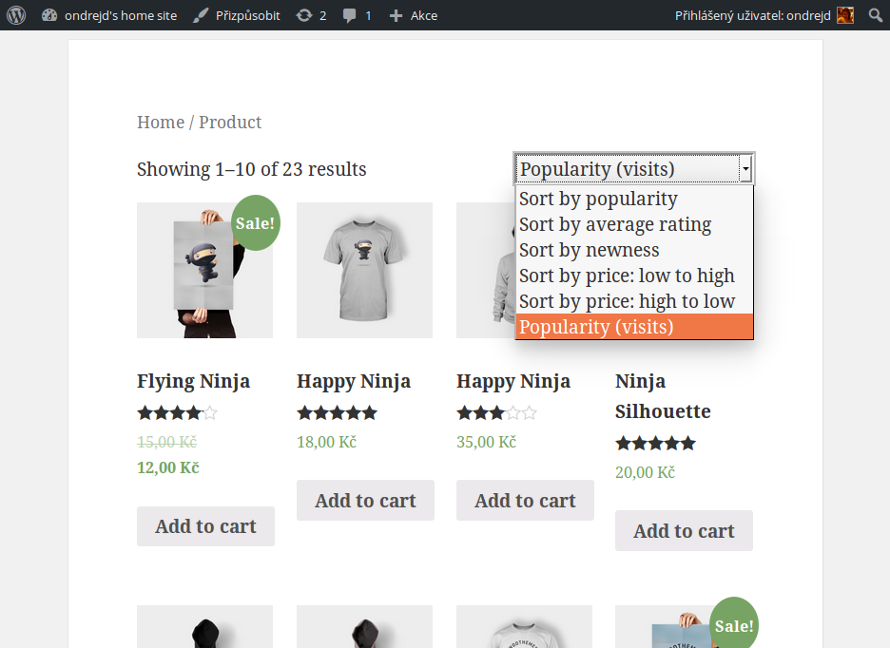
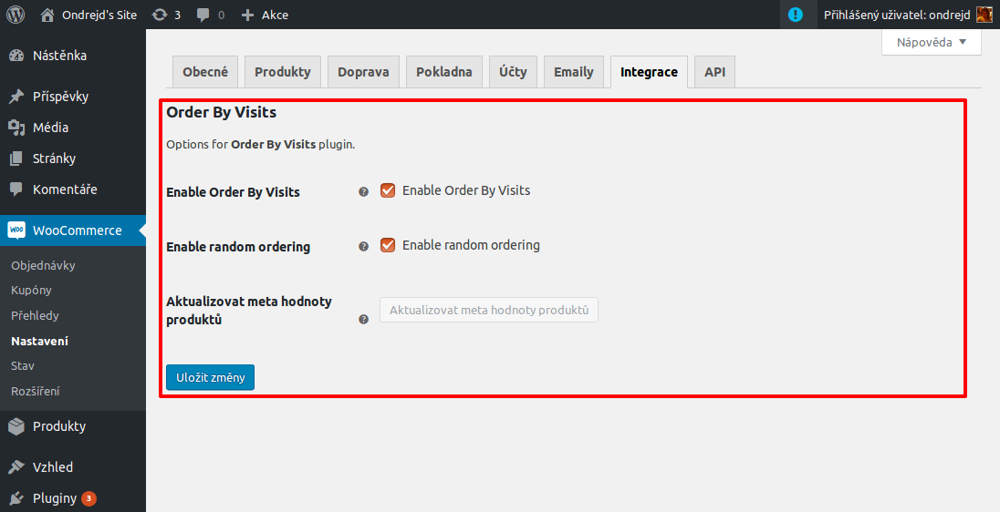
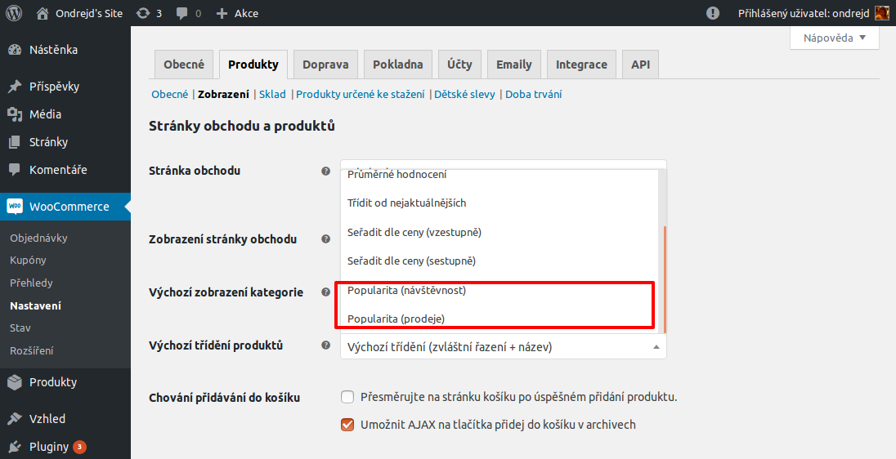

# Order by Visits Plugin for WooCommerce

Plugin for [WordPress][1] and [WooCommerce][2] that adds new products _orderby_ rules - __Order by popularity (views)__ and __Order by popularity (sales)__.

## Donations

If your like this plugin and you want to be maintained and improved more frequently consider donation:

[][3]

## Description

Main features:

* simple statistics about how many times was product displayed,
* possibility to generate random data,
* new products _orderby_ rules - __Order by popularity (views)__ and __Order by popularity (sales)__,
* Czech and English localization.

## Installation

Plugin's installation is easy:

1. Upload plugin's folder `odwp-wc-orderbypopularity` to the `/wp-content/plugins/` directory
2. Activate the plugin through the __Plugins__ menu in [WordPress][1]
3. For more details see [plugin's home page][4]

## Frequently Asked Questions

> When I should use this plugin?

Whenever you want some more products _orderby_ rules on __WooCommerce__ shop page.

> What data are collected?

Just count of display of product's detail page - value is saved as a product's meta value.

## Screenshots

1. Updated _orderby_ select
   
2. Settings of the plugin (_Admin -> WooCommerce -> Integration_):
   
3. Updated default _orderby_ select (_Admin -> WooCommerce -> Products -> Display_):
   

## License

This Source Code is subject to the terms of the [GNU General Public License 3.0][6].

## Changelog/TODO

### ~1.0

* [ ] publish on [WordPress Plugins][5] site

### 0.5.0

* code completely refactored
* tested on [WordPress 4.8.2][1] a [WooCommerce 3.1.2][2]
* released on [GitHub][4]'s repository
* finished functionality for button __Update products__ on settings page,
* for __Order by popularity (sales)__ use meta key `total_sales`,
* inline JavaScript moved to standalone file (`assets/js/admin.js`),
* inline CSS moved to standalone file (`assets/js/admin.css`).

### 0.3.0

* tested on [WordPress 4.6.1][1]
* renamed to __Order By Visits__

### 0.2.10

* fixed bug that occured after plugin's activation
* updated localization

### 0.2.9

* added __Enable CRON__ option and corresponding functionality

### 0.2.6

* fixed code in `ODWP_WC_SimpleStats_Integration`

### 0.2.5

* fixed that `enable` options was not used
* added option `enable_random` for enabling/disabling random order for products with same visits count.
* added button for generating random order values

### 0.2.0

* count how many times were project's detail viewed
* count how many times were project added to the cart
* adding our custom products ordering (__Popularity (visits)__)
* add Czech localization

### 0.1.1

* fixed `uninstall` hook
* fix integration (settings are not saved)

### 0.1.0

* initial public version
* source codes added to [GitHub][4]

[1]:https://wordpress.org/
[2]:https://wordpress.org/plugins/woocommerce/
[3]:https://www.paypal.me/ondrejd
[4]:https://github.com/ondrejd/odwp-wc-simplestats
[5]:https://wordpress.org/plugins
[6]:https://www.gnu.org/licenses/gpl-3.0.en.html
